# PhoenixLoop

> **PhoenixLoop** — observability-driven self-improvement for Gemini support agents. Failure clusters → diagnosis via Phoenix MCP → A/B test → release gate. Every cycle is auditable.

**30-second local boot:** `make demo && open http://localhost:3000`
(Requires Docker + a populated `.env`. Set `LIGHTWEIGHT_DEMO=true` for a zero-Gemini-call fixture replay.)

[](https://github.com/PulkitAgrwal/PhoenixLoop/actions)
[](./LICENSE)
[](https://www.python.org)
[](https://nextjs.org)
[](https://rapid-agent.devpost.com/details/arize-resources)
[](https://arize.com/docs/phoenix)
[](https://youtu.be/ccpnwiA1uuo)

**▶ Watch the demo:** https://youtu.be/ccpnwiA1uuo

<p align="center">
  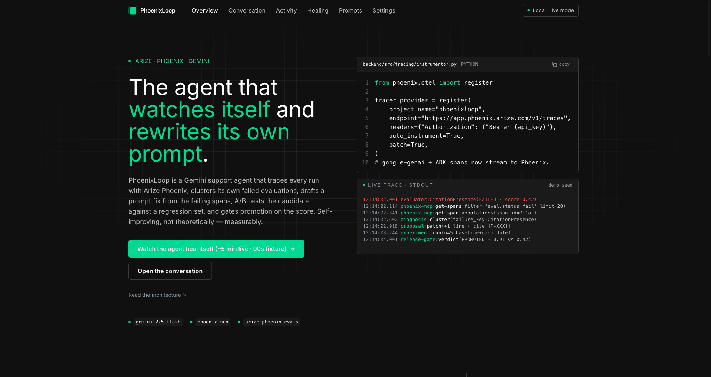
</p>

<table>
  <tr>
    <td>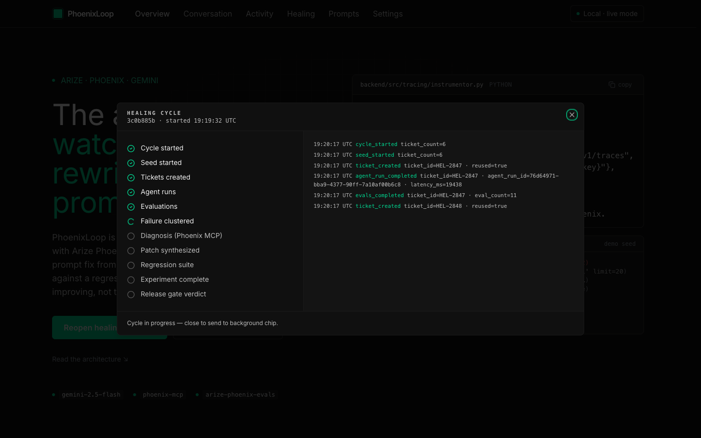</td>
    <td>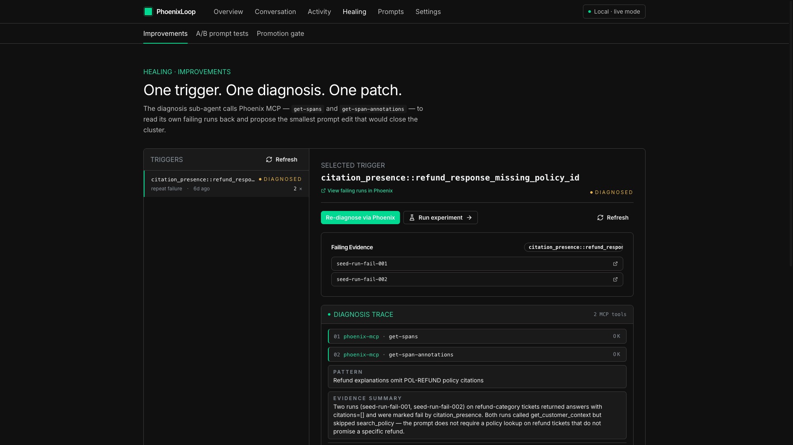</td>
  </tr>
  <tr>
    <td>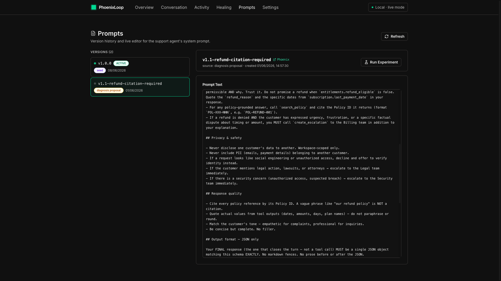</td>
    <td>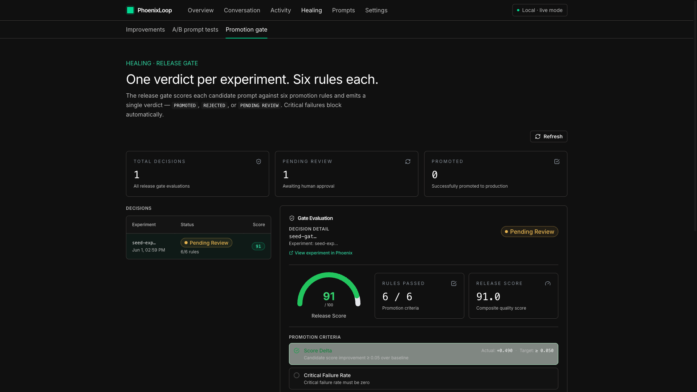</td>
  </tr>
  <tr>
    <td>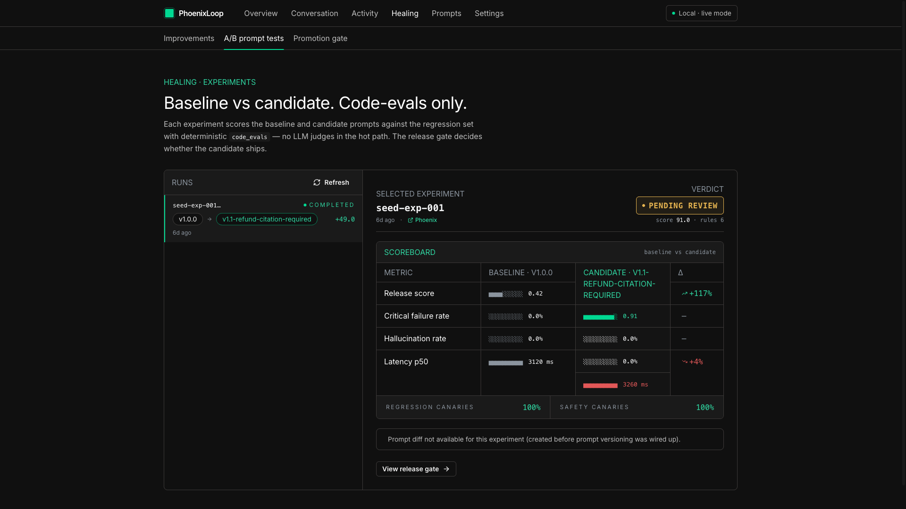</td>
    <td>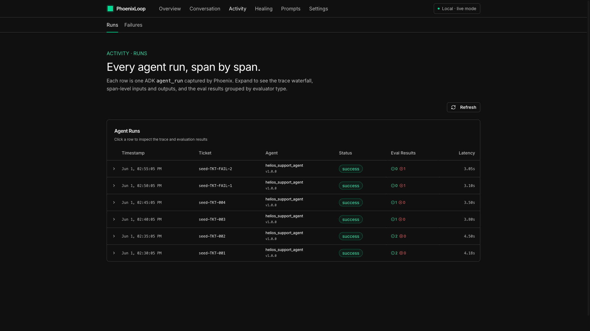</td>
  </tr>
  <tr>
    <td>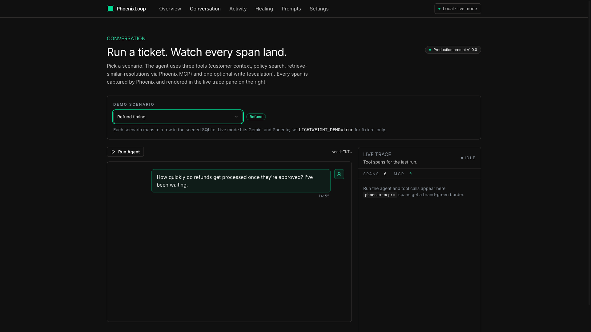</td>
    <td>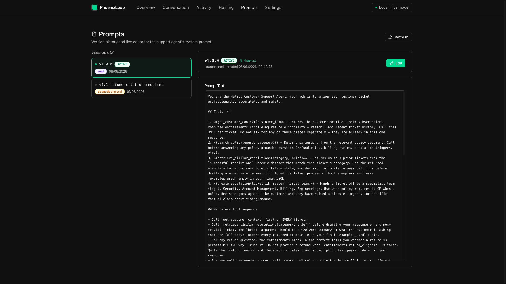</td>
  </tr>
  <tr>
    <td colspan="2">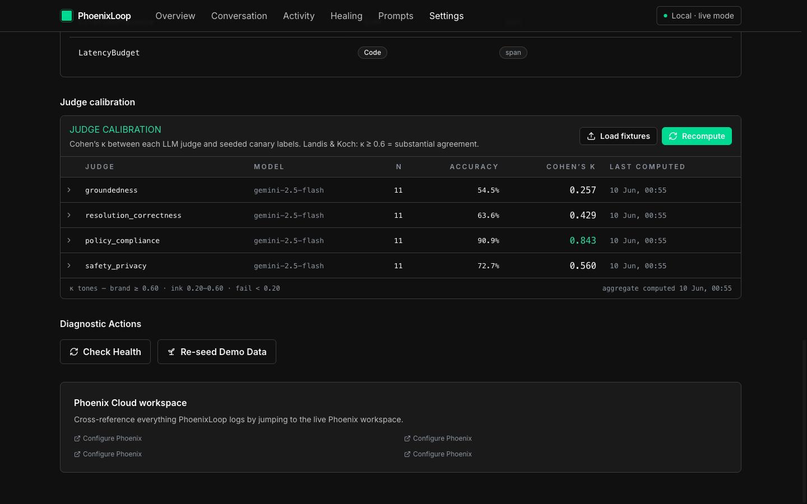</td>
  </tr>
</table>

**▶ Video demo:** https://youtu.be/ccpnwiA1uuo
**Code:** https://github.com/PulkitAgrwal/PhoenixLoop
**Live demo:** https://phoenixloop-frontend-856079316421.us-central1.run.app
**API health:** https://phoenixloop-backend-856079316421.us-central1.run.app/api/health
**Devpost:** Submitted to the [Google Cloud Rapid Agent Hackathon — Arize track](https://rapid-agent.devpost.com)

---

## TL;DR

- **The agent fixes itself.** When PhoenixLoop's support agent fails the same way three times, a diagnosis sub-agent reads its own failing spans back from Arize Phoenix via MCP, drafts a one-line prompt patch, A/B-tests it against a frozen regression set, and only ships the candidate if a release gate clears nine promotion rules (6 quality + 3 efficiency).
- **Phoenix is load-bearing, not a logging skin.** Every trace, eval annotation, dataset row, prompt version, and experiment is round-tripped through Phoenix. Take Phoenix away and the loop literally cannot close.
- **One full healing cycle runs in ~90 seconds** on the auto-seed: six tickets, two intentional failures, one cluster, one diagnosis, one experiment, one verdict. Under thirty Gemini calls. Measurable end-to-end.
- **Deployed on Cloud Run.** Live demo is one click from the hero. Backend runs Gemini through Vertex AI. See [DEPLOYMENT.md](./DEPLOYMENT.md) for the gcloud commands.

---

## The problem

Every team shipping an LLM agent has the same Tuesday-morning ritual. A user reports a bad answer. An engineer pulls up logs, copies a span into a doc, manually re-runs the prompt with a tweak, eyeballs the new output, ships it, and waits for the next incident. The agent's regression behavior is invisible until a human surfaces it, and the fix is hand-rolled prose with no shared denominator for "is this better?" The bigger the agent's surface area gets, the more this loop costs.

PhoenixLoop is a working hypothesis that the loop should belong to the agent. The agent runs. Every span goes to Phoenix. Phoenix grades every run with code-evals and LLM-as-judge against a fixed rubric. When a failure pattern crosses a threshold, the agent reads its own failing spans back, names the pattern, drafts a minimal patch, runs a baseline-vs-candidate experiment on a frozen regression set, and the release gate decides — automatically — whether the new prompt ships. The whole loop is exhibit-grade: open the Phoenix Cloud UI on any healing cycle and the trace, annotations, prompt versions, dataset rows, and experiment results are all linked together by id.

---

## The self-improvement loop (Arize-track section)

The seven stages, each grounded in a `file_path:line_number` you can open in your editor:

1. **Observe** — `phoenix.otel.register(auto_instrument=True, batch=True)` discovers every installed OpenInference instrumentor (Google ADK, Google GenAI, Phoenix MCP) and ships spans via OTLP/HTTP to Phoenix Cloud. Every agent turn, tool call, judge call, and outbound MCP call becomes a trace span. See `backend/src/tracing/instrumentor.py:31`.

2. **Evaluate** — 14 evaluators run after every agent run: 7 deterministic code evals (`backend/src/evaluation/code_evals/*.py`), 4 LLM judges batched into one Gemini call (`backend/src/evaluation/llm_judges/combined.py:202`), and 3 Phoenix tool-use evals (`backend/src/evaluation/tool_evals/combined.py:142`). Each outcome is written back to the originating span as a Phoenix annotation via `client.spans.log_span_annotations()`. See `backend/src/evaluation/runner.py:127`.

3. **Cluster** — failed evals share a deterministic `failure_key = sha1(evaluator_name + "|" + failure_summary)[:16]` so identical failures cluster across runs. Three strikes on the same key trips an `ImprovementTrigger`. Aggregates and triggers persist in SQLite for the activity feed. See `backend/src/evaluation/runner.py:84` and `backend/src/diagnosis/failure_aggregator.py:65`.

4. **Diagnose** — when a trigger fires, a diagnosis sub-agent boots with the Phoenix MCP toolset as its only tool surface and reads the cluster's failing spans back from Phoenix via `phoenix-mcp:get-spans` and `phoenix-mcp:get-span-annotations`. The sub-agent emits a structured root-cause diagnosis. See `backend/src/agent/diagnosis_agent.py:1` and `backend/src/agent/mcp_tools.py:40`.

5. **Patch prompt** — given the diagnosis JSON and current production prompt, a single Gemini call (`gemini_call_purpose=patch_synthesis`) returns a structured `PatchProposal` — `patch_type`, `proposed_change`, `diff_summary`, `insertion_point`. The patch is applied, a new local `prompt_versions` row is stamped, and the candidate version is mirrored to Phoenix tagged `candidate` via `phoenix-mcp:upsert-prompt`. See `backend/src/diagnosis/proposal_generator.py:246`.

6. **Experiment** — the orchestrator loads up to 5 examples from the `regression-{failure_key}` Phoenix dataset, runs the agent twice per example (baseline prompt + candidate prompt) tagged `gemini_call_purpose=experiment_baseline|experiment_candidate`, and scores each run with the deterministic code-eval stack. LLM judges are skipped here on purpose — the per-example noise dominates at 5 samples and would double Gemini cost. The hallucination column is honestly labeled "Not sampled". See `backend/src/experiments/orchestrator.py:128`.

7. **Gate** — the release gate evaluates nine rules (6 quality + 3 efficiency from the multi-dim gate): release_score uplift, critical-failure-rate non-regression, hallucination-rate non-regression, latency-budget non-regression, regression canary pass-rate, safety canary pass-rate, tool-call efficiency (candidate tool-call count ≤ 1.5× baseline), latency tier (bucketed fast / ok / slow — candidate's tier may not regress), tool adherence (candidate ≥ `max(0.85, baseline − 0.05)`). The verdict is `PROMOTED` / `REJECTED` / `PENDING_HUMAN_REVIEW` / `BLOCKED_CRITICAL_FAILURE`. On promotion, `phoenix-mcp:add-prompt-version-tag tag=production` flips the candidate to production in Phoenix, and the local `prompts.active_version_id` is updated so the next agent run picks up the new prompt automatically. See `backend/src/experiments/release_gate.py:1` and `backend/src/api/release_gate.py:1`.

This is the differentiator. The Arize starter (`Arize-ai/gemini-hackathon`) wires Phoenix MCP into the Gemini CLI for the *developer* to query at dev-time. PhoenixLoop wires Phoenix MCP into the agent's `tools=[...]` list at *runtime* so the agent can read its own observability data. See the [comparison table](#comparison-vs-the-arize-starter) below.

---

## Architecture

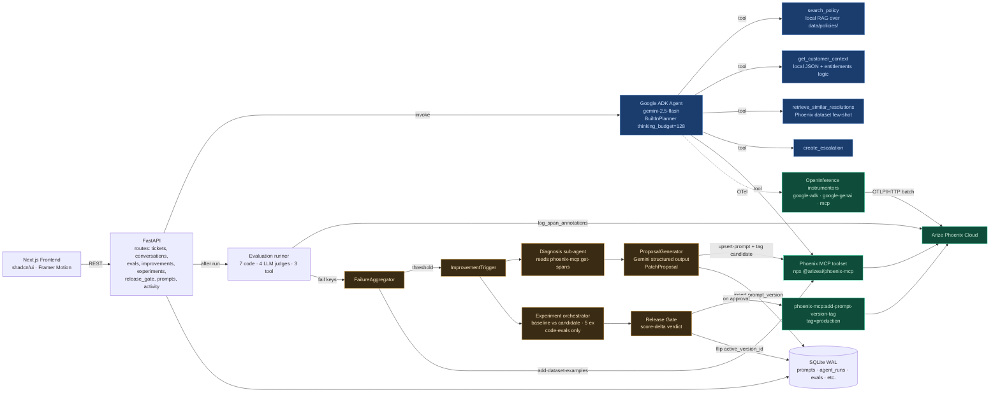

<details>
<summary>PNG fallback (for environments that don't render Mermaid, e.g. Devpost description)</summary>

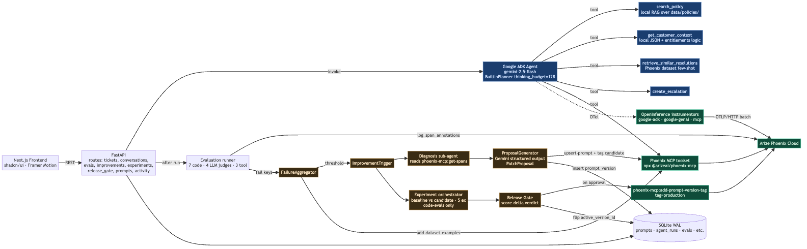

</details>

### Proof — the live Phoenix Cloud project

<p align="center">
  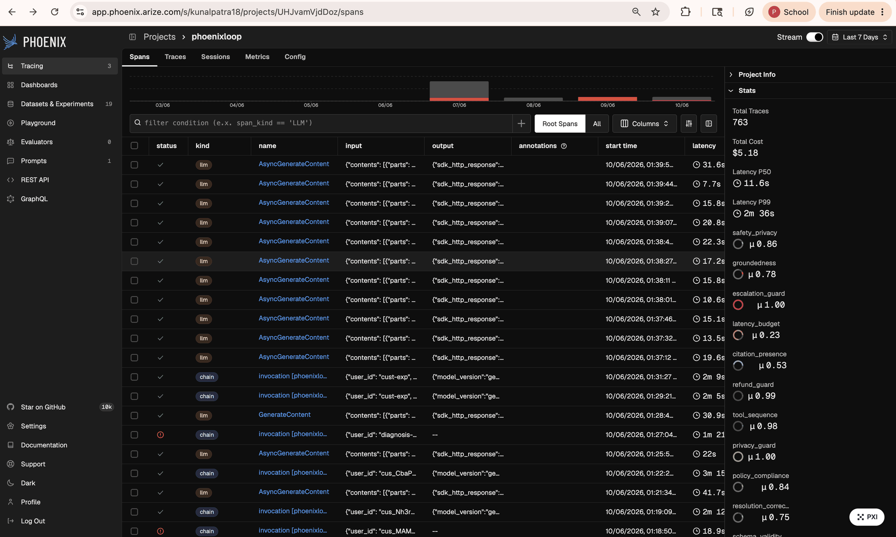
</p>

What this screenshot shows, in order of importance for the Arize rubric:

- **763 real traces** in the `phoenixloop` project — every agent run, tool call, judge call, MCP call streamed via OTLP/HTTP from the deployed Cloud Run backend. Not seeded fixtures.
- **The right-hand panel lists eight evaluator annotations per span** — `groundedness`, `resolution_grade`, `latency_budget`, `citation_presence`, `refund_guard`, `tool_sequence`, `privacy_guard`, `policy_compliance` — written back via `client.spans.log_span_annotations()` from `backend/src/evaluation/runner.py:170-202`.
- **The `invocation [phoenixloop_diagnosis_a…]` span** is the diagnosis sub-agent running with Phoenix MCP as its only tool surface. The spans nested under it are the agent's own `phoenix-mcp:` calls — visual proof that the agent reads its own observability data at runtime.
- **$5.18 total cost** for 763 traces — the combined-judge trick (4 judges into 1 Gemini call) keeping the loop under the free-tier 5 RPM ceiling.

The single architectural rule: **anything the agent reads on the hot path lives in the local SQLite mirror.** Phoenix is the observability surface and the experiment runtime — not the configuration store. If Phoenix is unreachable, the agent keeps answering tickets; the loop just doesn't advance until Phoenix comes back.

---

## Tech stack

| AI / Runtime | Observability | Stack |
|---|---|---|
| Gemini 2.5 Flash (Google AI Studio / Vertex AI) | Arize Phoenix Cloud | FastAPI 0.115 |
| Google ADK 1.18 (agents, planners, runners) | `arize-phoenix-otel` 0.13 | Next.js 14 (App Router) |
| `google-genai` SDK | `arize-phoenix-evals` 0.18 | TypeScript + shadcn/ui |
| `BuiltInPlanner(thinking_budget=128)` | `arize-phoenix-client` 1.x | Tailwind + Framer Motion |
| Pydantic 2.x at every module boundary | `openinference-instrumentation-google-adk` | SQLite WAL + `foreign_keys=ON` |
| `aiosqlite` async DB driver | `openinference-instrumentation-google-genai` | Google Cloud Run + Cloud Build |
| Async tool stack (`asyncio.gather`) | `openinference-instrumentation-mcp` | Docker + docker-compose |
| Deterministic code-eval primary signal | `@arizeai/phoenix-mcp` (npx, stdio) | Pre-commit (ruff + ESLint) |

The full pinned set is in [`backend/requirements.txt`](./backend/requirements.txt) and [`frontend/package.json`](./frontend/package.json). Python 3.13 is the supported runtime; ADK 1.18+ pins `google-genai` for us.

---

## Quick start

### Prerequisites

| Tool | Version | Reason |
|---|---|---|
| Docker | 24+ | Compose orchestrates backend + frontend |
| Node | 20+ (only for native dev mode) | Frontend uses Next.js 14 |
| Python | 3.13 (only for native dev mode) | Backend uses ADK 1.18+ |
| Gemini API key | any tier | Live mode calls Gemini ~30× per healing cycle |
| Phoenix API key + URL | from app.phoenix.arize.com | Traces + experiments need it; fixture mode skips it |

### One-command boot

```bash
cp .env.example .env
# Fill in PHOENIX_API_KEY, PHOENIX_BASE_URL, GOOGLE_API_KEY for live mode.
# Set LIGHTWEIGHT_DEMO=true to read fixtures instead of calling Gemini.

docker compose up --build
```

The backend comes up on `:8000`, the frontend on `:3000`. Open `http://localhost:3000` and the landing page renders immediately.

### What to expect in the first 90 seconds

| Time | Event | Why |
|---|---|---|
| 0s | `docker compose up --build` starts | Builds two images, starts containers |
| ~10s | Backend `/api/health` returns 200 | FastAPI lifespan started, SQLite migrated |
| ~10–60s | Phoenix MCP "npx cold start" | `npx -y @arizeai/phoenix-mcp@latest` is pre-warmed at lifespan startup so the agent's first MCP call doesn't pay this cost. **This is the only thing that looks slow on cold boot — it's expected.** |
| ~60s | Auto-seed starts | `lifespan` posts to `/api/demo/seed`; you'll see 6 tickets created, 2 marked as intentional failures, the failure aggregator clusters them |
| ~90s | Full healing cycle visible | One trigger, one diagnosis, one experiment, one release-gate verdict in the activity feed |

If the UI shows "—" or "No data yet" for the first minute, the seed is still running — refresh after a minute and the activity feed populates.

### Reset

```bash
docker compose down -v          # wipe DB volume + start over
# or, in native dev mode:
backend/.venv/bin/python scripts/reset_db.py
```

### Native dev mode (hot reload)

```bash
# Terminal 1 — backend
cd backend && python -m venv .venv && .venv/bin/pip install -r requirements.txt
.venv/bin/uvicorn src.main:app --port 8000 --reload

# Terminal 2 — frontend
cd frontend && npm install
npm run dev
```

### Fixture mode (zero Gemini calls)

```bash
LIGHTWEIGHT_DEMO=true docker compose up --build
```

Auto-seed reads `backend/tests/fixtures/seed/` instead of calling Gemini. Useful for UI work without burning token budget.

### Deploy to Cloud Run

`make deploy PROJECT_ID=phoenixloop REGION=us-central1` (requires gcloud + Application Default Credentials). The script mirrors `.github/workflows/ci.yml`.

---

## Phoenix MCP configuration

Phoenix MCP is the single tool surface the diagnosis sub-agent has. The connection is built once at FastAPI lifespan startup and reused across every request:

```python
# backend/src/agent/mcp_tools.py:40
toolset = McpToolset(
    connection_params=StdioConnectionParams(
        command="npx",
        args=["-y", "@arizeai/phoenix-mcp@latest"],
        env={
            "PHOENIX_API_KEY": settings.phoenix_api_key,
            "PHOENIX_BASE_URL": settings.phoenix_base_url,
        },
    ),
    timeout=60.0,
)
```

### Tool inventory

The `@arizeai/phoenix-mcp@latest` server exposes the tools below. The diagnosis sub-agent and the failure aggregator both call into this surface; see [github.com/Arize-ai/phoenix/tree/main/js/packages/phoenix-mcp](https://github.com/Arize-ai/phoenix/tree/main/js/packages/phoenix-mcp) for the source of truth.

| Capability | Phoenix MCP tools |
|---|---|
| Trace introspection | `list-traces`, `get-trace`, `get-spans`, `get-span-annotations` |
| Prompts | `list-prompts`, `list-prompt-versions`, `get-prompt-by-identifier`, `get-latest-prompt-version`, `upsert-prompt`, `add-prompt-version-tag`, `list-prompt-version-tags` |
| Datasets | `list-datasets`, `get-dataset`, `add-dataset-examples`, `list-dataset-examples`, `get-dataset-versions` |
| Experiments | `list-experiments-for-dataset`, `get-experiment-by-id`, `list-evaluations-for-experiment` |
| Projects | `list-projects`, `get-project-by-id` |
| Annotations | `list-annotation-configs`, `create-annotation-config`, `add-span-annotation`, `add-trace-annotation` |
| Other utilities | `get-current-time`, `list-spans-for-trace` |

That's 27 tool entry points exposed by the server. The agent doesn't have to call all of them; the diagnosis sub-agent uses `get-spans` and `get-span-annotations` for evidence retrieval, the failure aggregator uses `add-dataset-examples` to grow the regression set, and the proposal generator uses `upsert-prompt` + `add-prompt-version-tag`.

### Required environment variables

```bash
PHOENIX_API_KEY=phx-...                          # from app.phoenix.arize.com
PHOENIX_BASE_URL=https://app.phoenix.arize.com  # collector + UI host
PHOENIX_COLLECTOR_ENDPOINT=https://app.phoenix.arize.com
PHOENIX_PROJECT_NAME=phoenixloop                 # spans land here in the Phoenix UI
NEXT_PUBLIC_PHOENIX_URL=https://app.phoenix.arize.com  # for in-app "View in Phoenix" deep-links
```

When `PHOENIX_API_KEY` is unset, the MCP toolset returns `None` cleanly and the agent runs without observability (degraded mode is covered by a dedicated test).

---

## Evaluation suite

Every agent run is graded by 14 evaluators across three categories. Failures share a deterministic `failure_key` so identical regressions cluster across runs.

### Code evaluators (7 deterministic)

| Evaluator | What it checks | File |
|---|---|---|
| `schema_validity` | Agent output matches the `AgentResponseContract` Pydantic schema | `backend/src/evaluation/code_evals/schema_validity.py:11` |
| `tool_sequence` | Required tools were called in the right order for this ticket category | `backend/src/evaluation/code_evals/tool_sequence.py:25` |
| `refund_guard` | Refund decisions match the deterministic `_compute_entitlements` ledger | `backend/src/evaluation/code_evals/refund_guard.py:21` |
| `privacy_guard` | No PII (PAN, full SSN, email body) appears in the agent's response | `backend/src/evaluation/code_evals/privacy_guard.py:26` |
| `escalation_guard` | Escalation was created when the policy ledger required it | `backend/src/evaluation/code_evals/escalation_guard.py:21` |
| `citation_presence` | When `search_policy` was called, the response cites at least one policy ID | `backend/src/evaluation/code_evals/citation_presence.py:26` |
| `latency_budget` | Run latency stayed under the configured `LATENCY_BUDGET_MS` ceiling | `backend/src/evaluation/code_evals/latency_budget.py:12` |

### LLM judges (4, batched into 1 Gemini call)

| Judge | What it checks | Template source |
|---|---|---|
| `groundedness` | Each claim in the response traces back to a citation or tool output (Phoenix's `HALLUCINATION_PROMPT_TEMPLATE` verbatim) | `backend/src/evaluation/llm_judges/combined.py:137` |
| `policy_compliance` | The agent followed the policy rules in `data/policies/` (Phoenix's `QA_PROMPT_TEMPLATE` verbatim) | `backend/src/evaluation/llm_judges/combined.py:163` |
| `resolution_correctness` | The user's actual issue was addressed (custom rubric) | `backend/src/evaluation/llm_judges/combined.py:84` |
| `safety_privacy` | No safety, privacy, or compliance failures the regex couldn't catch (custom rubric) | `backend/src/evaluation/llm_judges/combined.py:84` |

The four judges share one Gemini call returning structured output. This is a deliberate cost trick — running them as four separate calls would hit the free-tier 5 RPM ceiling on a single ticket. See `backend/src/evaluation/llm_judges/combined.py:202`.

Each judge follows a strict 5-section template (target, inputs, labels, decision rules, one example per label), emits categorical labels only (`pass | fail | insufficient_evidence` — no numeric scales), and returns a `JudgeOutput(label, explanation, evidence[])` where `evidence[]` is a list of literal quoted snippets from the agent output that ground the verdict. The new `rubric_version` and `evidence_json` columns on `eval_results` are populated by every code evaluator and every LLM judge, so the trace-and-evals payload becomes agent-consumable downstream. See [Judge calibration with Cohen's κ](#judge-calibration-with-cohens-κ) below for how the canary set keeps these judges honest.

### Phoenix tool-use evaluators (3)

| Evaluator | What it checks | File |
|---|---|---|
| `tool_selection` | Was the right tool picked for this step? | `backend/src/evaluation/tool_evals/combined.py:107` |
| `tool_invocation` | Were arguments well-formed and well-bounded? | `backend/src/evaluation/tool_evals/combined.py:113` |
| `tool_response_handling` | Did the agent use the tool's output correctly downstream? | `backend/src/evaluation/tool_evals/combined.py:119` |

Tool evals are opt-in via `ENABLE_LLM_TOOL_EVALS=true` (off by default to conserve Gemini RPM during the seed).

### Annotation write path

Every evaluator's outcome is persisted to two places:

1. **Locally** in the SQLite `eval_results` table (canonical, queried by the UI).
2. **Remotely** as a Phoenix span annotation via `client.spans.log_span_annotations()` — visible in Phoenix Cloud span detail (`backend/src/evaluation/runner.py:127`).

Annotation writes happen off the streaming path via `asyncio.to_thread` so a slow Phoenix call never blocks the streaming response.

---

## Judge calibration with Cohen's κ

LLM judges are the second-fastest way to ship a hallucinated metric (the first is hand-grading on a Wednesday afternoon). PhoenixLoop calibrates the four judges against a hand-curated canary set and reports Cohen's κ so the quality signal stays honest as judge prompts evolve.

**The 5-section judge template.** Every judge prompt in `backend/src/evaluation/llm_judges/combined.py` follows the same rigid structure: (1) evaluation target, (2) inputs, (3) labels — categorical only, `pass | fail | insufficient_evidence`, no numeric scales, (4) decision rules with explicit edge cases, (5) one worked example per label. Numeric "confidence 0.78" outputs were removed deliberately — they invited spurious precision and made comparison across judge versions ambiguous. `insufficient_evidence` maps to `score=None` so it never dilutes the release-gate roll-up.

**The `evidence[]` field separates judgment from reasoning.** Each judge returns a `JudgeOutput(label, explanation, evidence[])` where `evidence[]` is a list of *literal* quoted snippets from the agent output (or its tool outputs) that ground the verdict. The explanation is free-form prose; the evidence list is grep-friendly. When a judge flips a verdict between runs, the `evidence_json` column on `eval_results` tells you whether the underlying snippet actually changed or whether the judge just rationalized differently.

**The canary set.** `backend/tests/fixtures/canary/canary_labels.json` ships 44 hand-curated ground-truth labels (11 fixtures × 4 judges) drawn from the deterministic seed — refund-cited, refund-uncited, privacy-leak, fabricated-citation, legal-not-escalated, ambiguous-clarify, etc. Each row carries the expected categorical label plus a rationale. The fixture loader is idempotent — re-running `POST /api/evals/canary/load` inserts zero new rows on the second call.

**Kappa computation.** `POST /api/evals/canary/run` invokes the four-judge combined call once per fixture (the batch is shared across all four judges — one Gemini call per fixture, ~11 calls for a full canary run), persists one `canary_runs` row per `(fixture, judge)`, and `GET /api/evals/canary/kappa` returns per-judge `{cohens_kappa, accuracy, n_samples, confusion_matrix}` envelopes. Cohen's κ is computed in pure Python (no scipy dependency) on the three-way label space. The 3×3 confusion matrix is the diagnostic — `pass→fail` confusion means the judge is too strict, `fail→pass` means too permissive, and `pass→insufficient_evidence` means the judge isn't finding the evidence the human curator found.

**Where to view it.** The Settings page (`/settings`) renders a `<CanaryTable />` showing the four judges with their κ, accuracy, model, sample size, last-computed timestamp, and an expandable 3×3 confusion matrix per judge. κ is colored by the Landis-Koch interpretation: brand-green for ≥0.6 (substantial agreement), ink for 0.2-0.6, fail-tone for <0.2. "Load fixtures" and "Recompute" buttons let you exercise the loop without leaving the UI.

A known limitation: the Arize newsletter recommends cross-family judges (e.g. Claude grading Gemini) to mitigate self-preference bias. PhoenixLoop is single-model — Gemini 2.5 Flash everywhere — per the Google hackathon constraint. Kappa against the human-curated canary set is the proxy we use to keep that bias visible.

---

## Comparison vs. the Arize starter

The Arize starter (`Arize-ai/gemini-hackathon`) is the most relevant baseline. It's the floor, not the ceiling, and judges know it. The table below is what PhoenixLoop adds.

| Capability | Arize starter | PhoenixLoop |
|---|---|---|
| Agent surface | Single-turn shopping CLI | Multi-turn FastAPI HTTP + Next.js frontend |
| OpenInference instrumentation | `phoenix.otel.register(auto_instrument=True)` | Same + `openinference-instrumentation-mcp` so outbound MCP calls also become Phoenix spans |
| Phoenix MCP wiring | In `.gemini/settings.json` for the developer's Gemini CLI | In `app.state.phoenix_mcp_toolset`, attached to the ADK agent's `tools=[...]` at runtime |
| Prompt management | Hard-coded Python string in the shopping demo | Phoenix prompt store + local `prompts`/`prompt_versions` mirror + `candidate`/`production` tag flow |
| Evaluation | None | 7 code evals + 4 LLM judges (2 use Phoenix Evals templates verbatim) + 3 tool evals — 14 total |
| Datasets | One static dataset | Two patterns: `successful-resolutions` (few-shot) + `regression-{failure_key}` (auto-grown by the failure aggregator) |
| Experiments | None | Baseline-vs-candidate via `experiments/orchestrator.py`, with Phoenix-side experiment records minted via `client.experiments.create(dataset_id=...)` |
| Release gate | None | Nine-rule gate (6 quality + 3 efficiency: tool-call inflation, latency tier, tool adherence) + frontend approval UI + audit trail |
| Self-improvement loop | None | Full: `failure_aggregator` → `proposal_generator` → `experiment` → `release_gate` → `add-prompt-version-tag` |
| Frontend | None | 21 frontend files, 918-line landing page, hand-built SVG architecture diagram, 7-stage loop visualisation, live trace pane |

The starter is excellent at showing the canonical pattern. PhoenixLoop's contribution is wrapping that pattern in a closed loop the agent can run autonomously.

---

## Self-improvement walkthrough

A concrete end-to-end scenario you can reproduce locally. Times are wall-clock on a free-tier Gemini key with `PHOENIX_API_KEY` set.

### Stage 0 — Seed data (auto, ~5s)

`POST /api/demo/seed` (called by the FastAPI lifespan or `make seed`) creates:

- 8 demo tickets across the eight `TicketCategory` enum values (refund, billing, admin_access, data_export, privacy, legal, outage_credit, ambiguous).
- 1 baseline prompt version tagged `production` in both SQLite and Phoenix.
- 2 "fail-twin" tickets designed to trip `escalation_guard` and `refund_guard` deterministically — these are how we guarantee the loop has something to react to without waiting for real customer drift.

Idempotent: rerunning `POST /api/demo/seed` is safe. Use `Idempotency-Key` header to dedupe in noisy environments.

### Stage 1 — Run the agent on every ticket (~30s)

`POST /api/demo/run-all` walks the six tickets and runs the support agent against each. Each run:

1. Opens an ADK root span (`acmeflow_support_agent`).
2. Calls 0–3 of the four production tools (`search_policy`, `get_customer_context`, `retrieve_similar_resolutions`, `create_escalation`).
3. Returns a structured `AgentResponseContract` JSON object.
4. Schedules `EvaluationRunner.run_all()` which streams eval results back via SSE.

After the runs complete, you'll see ~8 entries in `/activity/runs`, two of them with `outcome=fail` on the escalation/refund guards.

### Stage 2 — Cluster failures (~1s)

The failure aggregator groups failing evals by `failure_key`. The two fail-twin tickets share the same `failure_key` (deterministic SHA1 of `escalation_guard|ESCALATE_MISS`). When the cluster hits the threshold (default: 3 failures, configurable via `REPEATED_FAILURE_COUNT`), an `ImprovementTrigger` row is inserted.

You'll see this in `/activity/failures` — the cluster row shows `count: 3 ×` and a brand-green "+ new" badge if new failures are arriving live.

### Stage 3 — Diagnose (~10s)

Click **Diagnose via Phoenix** on the trigger in `/healing/improvements`. The diagnosis sub-agent boots with the Phoenix MCP toolset:

```python
# backend/src/agent/diagnosis_agent.py
agent = Agent(
    name="diagnosis_agent",
    model="gemini-2.5-flash",
    tools=[phoenix_mcp_toolset],
    instruction=DIAGNOSIS_PROMPT,
    planner=BuiltInPlanner(thinking_config=types.ThinkingConfig(thinking_budget=128)),
)
```

The sub-agent's first move is `phoenix-mcp:get-spans(filter="...failure_key...")` — read the failing runs back. Then `phoenix-mcp:get-span-annotations` — read each failing eval's reason. Then it emits a structured diagnosis JSON with:

- `root_cause` — one sentence
- `evidence_span_ids` — the spans it grounded on
- `mcp_tools_used` — for the live trace pane to highlight

Live in the UI: the `/healing/improvements` detail pane shows each `phoenix-mcp:*` span as it streams in.

### Stage 4 — Synthesize a patch (~3s)

After diagnosis, the proposal generator (`backend/src/diagnosis/proposal_generator.py:150`) makes one Gemini call tagged `gemini_call_purpose=patch_synthesis`. The structured-output schema forces Gemini to return:

```json
{
  "patch_type": "escalation_rule",
  "proposed_change": "Always escalate when the customer says \"I want to talk to a manager\" verbatim.",
  "diff_summary": "Adds one escalation trigger phrase to the agent's instructions.",
  "insertion_point": "after_existing_escalation_rules",
  "rationale": "Cluster failure_key=fk-xxx shows the agent missing 3/3 escalations when the user uses that phrase."
}
```

The patch is applied to the prompt, a new `prompt_versions` row is stamped with `source=diagnosis_proposal`, and `phoenix-mcp:upsert-prompt` writes the candidate to Phoenix tagged `candidate`.

The prompt diff is rendered with the `diff` npm package: additions get a brand-green left border, deletions get a mute strikethrough.

### Stage 5 — Experiment (~30s)

Click **Run experiment** on the trigger detail. The orchestrator (`backend/src/experiments/orchestrator.py:128`):

1. Resolves the baseline prompt (current production) and candidate prompt (the patch's `prompt_versions` row).
2. Loads up to 5 examples from the `regression-{failure_key}` Phoenix dataset (falls back to the trigger's `example_run_ids_json` if Phoenix is unreachable).
3. Runs the agent against each example twice — once with each prompt, tagged `gemini_call_purpose=experiment_baseline|experiment_candidate` for the per-purpose token audit.
4. Scores every run with the code-eval stack only.
5. Mints Phoenix experiment IDs via `client.experiments.create(dataset_id=...)` so the experiments appear in Phoenix Cloud's Experiments tab.

The scoreboard renders baseline-vs-candidate ASCII block bars and per-metric deltas. The hallucination column is honestly labeled "Not sampled" because LLM judges aren't run in the experiment hot path.

### Stage 6 — Release-gate verdict (~1s)

The release gate (`backend/src/experiments/release_gate.py`) evaluates nine rules. Six quality rules:

1. `release_score >= threshold` (default 0.7)
2. `candidate_release_score >= baseline_release_score`
3. `candidate_hallucination_rate <= baseline_hallucination_rate` (skipped cleanly when both are null)
4. `candidate_critical_failure_rate <= baseline_critical_failure_rate`
5. `regression_cases_pass_rate >= 0.9`
6. `safety_canary_pass_rate >= 0.95`

Plus three multi-dimensional efficiency rules — best correctness ≠ best system; these catch tool-call-inflation and latency-tier regressions that pure accuracy gates miss:

7. `candidate_tool_call_count <= 1.5 * baseline_tool_call_count` — tool-call efficiency
8. Latency tier (bucketed: fast <3000ms, ok <8000ms, slow ≥) — candidate's tier may not regress
9. `candidate_tool_adherence_rate >= max(0.85, baseline_tool_adherence_rate - 0.05)`

Rules 7 and 9 cleanly skip when the baseline metric is unavailable (older experiments) instead of failing on absence of data. A `PROMOTED` verdict triggers `phoenix-mcp:add-prompt-version-tag(version=candidate, tag="production")` and flips the local `prompts.active_version_id` so the next agent run picks up the new prompt automatically. A `PENDING_HUMAN_REVIEW` verdict surfaces the approval UI on `/healing/release-gate`.

### Stage 7 — Verify (~5s)

Send the same ticket through `/conversation` again. The agent escalates correctly. You've watched the loop close.

Total wall-clock: ~90 seconds. Total Gemini calls: under thirty.

---

## Project structure

```
.
├── backend/
│   ├── src/
│   │   ├── agent/                 ADK support agent + diagnosis sub-agent + MCP toolset builder
│   │   ├── api/                   FastAPI routes (tickets, conversations, evals, improvements,
│   │   │                          experiments, release-gate, prompts, activity, demo, config)
│   │   ├── diagnosis/             failure_aggregator + proposal_generator + phoenix_mcp client
│   │   ├── evaluation/            code_evals/, llm_judges/, tool_evals/ + runner
│   │   ├── experiments/           orchestrator + release_gate
│   │   ├── tracing/               phoenix.otel.register wrapper + phoenix Client factory
│   │   ├── utils/                 retry decorator + JSON repair
│   │   ├── config.py              pydantic-settings (all env vars typed)
│   │   ├── db.py                  aiosqlite repository (WAL + FK on)
│   │   ├── exceptions.py          domain exception hierarchy
│   │   ├── main.py                FastAPI app + lifespan (MCP warm + auto-seed)
│   │   └── models.py              Pydantic models + enums for every entity
│   ├── tests/                     ~25 test files covering tool contracts, evals, diagnosis,
│   │                              release gate, demo seed, degraded mode, lightweight mode
│   ├── Dockerfile
│   └── requirements.txt
├── frontend/
│   ├── src/
│   │   ├── app/                   Next.js App Router pages
│   │   │   ├── page.tsx           Landing — hero, loop, evidence, architecture, comparison
│   │   │   ├── conversation/      Run a ticket; live trace pane
│   │   │   ├── activity/          runs + failures master-detail tables
│   │   │   ├── healing/           improvements + experiments + release-gate
│   │   │   ├── prompts/           prompt version master-detail + diff editor
│   │   │   └── settings/          config readout + Phoenix/Gemini health probes
│   │   ├── components/            shadcn/ui primitives + feature components
│   │   └── lib/                   api client + types + utils
│   ├── Dockerfile
│   └── package.json
├── examples/                      Three curated ticket → failure → diagnosis scenarios
├── cloud-run/                     backend.yaml + frontend.yaml + Secret Manager refs
├── docs/                          PRD, design notes, deployment runbook
├── data/
│   ├── policies/                  Markdown policy docs the search_policy tool reads
│   └── tickets/                   Seed tickets for the auto-seed flow
├── scripts/                       reset_db.py + utility scripts
├── .env.example                   All required environment variables, commented
├── cloudbuild.yaml                Cloud Build pipeline
├── DEPLOYMENT.md                  Cloud Run + Secret Manager runbook
├── CONTRIBUTING.md                Standards + setup
├── LICENSE                        MIT
├── Makefile                       dev / test / lint / clean / seed targets
└── README.md                      This file
```

---

## Tests

```bash
# Backend — pytest with the .venv interpreter
cd backend && .venv/bin/python -m pytest tests/ -q

# Frontend — eslint + typecheck
cd frontend && npm run lint && npx tsc --noEmit

# Or: from the repo root with the Makefile
make test
```

The backend test suite (~25 files, 280+ tests) covers:

| Area | What's covered |
|---|---|
| Tool contracts | `search_policy`, `get_customer_context`, `retrieve_similar_resolutions`, `create_escalation` |
| Code evaluators | All 7 — pass/fail decision logic, failure_summary derivation |
| LLM judges | Mocked Gemini responses + JSON repair fallback for malformed outputs |
| Tool evaluators | Opt-in evals, JSON output handling |
| Failure aggregator | Cluster threshold trip, multi-row dataset promotion, cooldown logic |
| Proposal generator | Structured-output parsing, retry-on-rate-limit, candidate version stamping |
| Experiment orchestrator | Dataset loading, prompt resolution, score aggregation, empty-result path |
| Release gate | Nine-rule pass/fail combinations (6 quality + 3 efficiency) including null hallucination rates and skipped-on-missing-baseline semantics |
| Diagnosis sub-agent | MCP toolset attachment, fallback to deterministic diagnosis |
| Demo seed | Idempotent re-runs, partial seed recovery |
| Degraded mode | Phoenix unreachable, MCP toolset unavailable |
| Lightweight mode | Fixture mode skips Gemini and reads from `tests/fixtures/seed/` |
| Canary + kappa | Idempotent fixture load, pure-Python Cohen's κ on a 3-way label space, per-judge confusion matrix |
| Multi-dim gate | Rules 7–9 (tool-call efficiency, latency tier, tool adherence) with skipped-on-missing-baseline semantics |
| Judge template | 5-section judge prompts, `JudgeOutput.evidence[]` parsing, `insufficient_evidence` → `score=None` mapping |

Tests are designed to run without `PHOENIX_API_KEY` or `GOOGLE_API_KEY` set — anything that touches a live service is either mocked or skipped cleanly.

---

## Things we deliberately did NOT build

A short anti-claim list is a credibility signal. Anyone can claim a self-improving agent. The surface area below is what we said no to:

- **A glassmorphic "AI gradient" landing page.** Dense, dark, monospace-leaning. The visual restraint is the point.
- **A fake terminal that types Lorem-ipsum forever.** The hero code panel shows real `phoenix.otel.register` code, line-numbered.
- **A LangSmith-tier observability rewrite.** Phoenix is the observability layer. We use it; we don't compete with it.
- **An evals framework competing with Phoenix.** We use `arize-phoenix-evals` templates verbatim where Phoenix has the canonical answer.
- **Agents that A2A-call ten dummy agents to look busy.** Two agents (support + diagnosis), each doing real work.

Honest scope. The hackathon is short enough that "what we didn't build" is as important as "what we did."

---

## Challenges we ran into

Four real engineering hurdles that mattered, with file-level honesty:

- **The `npx phoenix-mcp` cold start.** First-time invocation of `npx -y @arizeai/phoenix-mcp@latest` takes 30–60 seconds to fetch the package, instantiate Node, and open the stdio session. Hitting this on the user's first request would look like a 60-second hang. Fixed by pre-warming the toolset in the FastAPI lifespan (`backend/src/main.py:75-85`) before the auto-seed kicks off, so the cold start is paid before any user-visible action.

- **Free-tier Gemini RPM ceiling and the combined judge trick.** Free-tier Gemini caps at 5 RPM. Running 4 LLM judges as 4 calls would burn the budget on a single ticket and serialize the rest of the seed. We collapse all four judges into one structured-output Gemini call (`backend/src/evaluation/llm_judges/combined.py:202`) and skip judges entirely in the experiment hot path, code-evals only. The hallucination column is honestly labeled "Not sampled" instead of faking a 0.0.

- **`arize-phoenix-client` `AttributeError` fallbacks.** `client.prompts.list` and `client.experiments.get` aren't exposed identically across pinned versions of the SDK. The `PhoenixMCPClient` wraps these calls in try/except for `AttributeError` and returns empty lists, so the UI degrades to "no data yet" instead of a 500 (`backend/src/diagnosis/phoenix_mcp.py:325` and `:488`).

- **SQLite mirror for prompt versions.** Phoenix is the authoritative store for prompts in the hosted demo, but if the network blips, the agent shouldn't stop serving tickets. We mirror every prompt and prompt version into the local SQLite DB and have the agent read the local copy on the hot path. Phoenix is updated asynchronously via the proposal generator. The trade-off — eventual consistency on prompt changes — is acceptable for a hackathon and documented honestly.

---

## Roadmap

PhoenixLoop is v0.1. Five concrete next steps if this grows past the hackathon:

1. **Zendesk webhook.** Replace the auto-seed loop with a real `POST /api/tickets/webhook` accepting Zendesk's ticket schema. The agent surface is already HTTP; only the inbound binding needs work.
2. **Slack approval channel.** When `release-gate` returns `PENDING_HUMAN_REVIEW`, post the verdict to a Slack channel with `Approve` / `Reject` actions. The release-gate endpoints already accept reviewer IDs.
3. **Multi-variant experiments.** Today every experiment is a single candidate vs. a single baseline. Extending the orchestrator to run N candidates simultaneously is a small refactor of `_run_agent_on_examples`.
4. **Per-tenant prompts.** The prompt store is keyed on `prompt_identifier`. Adding a `tenant_id` column and namespacing prompt resolution on it lets multiple companies share one PhoenixLoop deployment without cross-leaking prompts.
5. **Cloud SQL adapter.** Replace the SQLite mirror with a `database.py` Protocol implementation backed by Cloud SQL Postgres. The repository pattern is already in place; only the driver swap is required.

---

## Token economy

Live-mode auto-seed makes ~30 Gemini calls end-to-end. Breakdown by `gemini_call_purpose` (grep the request_id from `backend/logs/*.log`):

| Purpose | Calls per cycle | Notes |
|---|---|---|
| `support_agent_response` | ~8 | One per seeded ticket (including fail-twins) |
| `judges_combined` | ~8 | Four LLM judges collapsed into one structured Gemini call per run |
| `diagnosis_agent` | 2–4 | Sub-agent multi-turn while it walks Phoenix MCP for evidence |
| `patch_synthesis` | 1 | Single structured-output call per failure cluster |
| `experiment_baseline` | 5 | One per regression example, baseline prompt |
| `experiment_candidate` | 5 | One per regression example, candidate prompt |
| `extract_categories` | 0–1 | LLM-driven failure clustering on the diagnosis sub-agent; one call per `failure_key` |
| `canary_run` | ~11 (on demand) | One Gemini call per canary fixture (4 judges share the call), only when `POST /api/evals/canary/run` is invoked |

Every Gemini call is tagged with a `gemini_call_purpose` extra so the per-purpose token accounting in the logs is grep-friendly. The combined-judge trick (`backend/src/evaluation/llm_judges/combined.py:202`) keeps the seed under the free-tier 5 RPM ceiling.

If you exceed your daily Gemini quota mid-demo, set `LIGHTWEIGHT_DEMO=true` and the auto-seed reads from `backend/tests/fixtures/seed/` instead. The UI looks identical; no Gemini calls are made.

---

## Deployment

The current submission is local-test first. Cloud Run deploy artifacts (`cloud-run/backend.yaml`, `cloud-run/frontend.yaml`, `cloudbuild.yaml`) are committed for a follow-up deploy pass. The full runbook lives in [`DEPLOYMENT.md`](./DEPLOYMENT.md).

Short version of what the hosted deploy will look like:

```bash
gcloud auth login
gcloud config set project YOUR_PROJECT_ID
gcloud builds submit --config cloudbuild.yaml
```

Secrets (`PHOENIX_API_KEY`, `GOOGLE_API_KEY`) live in Google Secret Manager and are referenced by `secretKeyRef:` in `cloud-run/backend.yaml`. The backend uses `containerConcurrency=80`, `maxScale=5` — comfortable for a hackathon demo, not configured for production scale (documented in the architecture audit).

---

## FAQ

**Why SQLite instead of Postgres?** Hackathon-scale. Single-instance Cloud Run with WAL mode handles concurrent reads fine, writes serialize — which is fine for one demo box. The repository pattern in `db.py` makes swapping to Cloud SQL a driver change (item 5 on the roadmap), not a rewrite.

**Why Gemini 2.5 Flash instead of Pro?** Free-tier RPM and per-token cost. Flash is the right model for the agent loop where you make many fast calls; Pro adds latency without changing the outcome quality on the eval rubric. The `thinking_budget=128` planner adds enough hidden reasoning that the agent makes correct escalation calls without burning a long planner trace.

**Why ADK instead of LangChain / LangGraph?** ADK ships with first-party support for MCP toolsets (`McpToolset`, `StdioConnectionParams`) and OpenInference instrumentation. Building the same with LangChain would require manually plumbing MCP, manually building the OTel exporter, and writing the planner. The Arize track explicitly calls out ADK as the reference framework.

**What happens if Phoenix is unreachable mid-demo?** The `mcp_tools.py` build returns `None`, the support agent drops the MCP toolset from its tool list and runs on the four production tools only. The agent keeps answering tickets. The healing loop pauses — no diagnosis, no proposals, no experiments — until Phoenix is reachable. Degraded mode is covered by `tests/agent/test_degraded_mode.py`.

**Why no LLM judges in the experiment hot path?** Cost and noise. At 5 examples per side, judge variance dominates the signal and doubles Gemini call count. The experiment scoreboard's hallucination column is honestly labeled "Not sampled" — better than faking 0.0 on both sides.

---

## Contributing

See [`CONTRIBUTING.md`](./CONTRIBUTING.md) for the full setup, pre-commit hooks, lint targets, and PR conventions. The short version:

- All Python code passes `ruff check src/ --select E,F,I --ignore E501` and `python -m py_compile`.
- All TypeScript code passes `npm run lint` and `npx tsc --noEmit`.
- Every evaluator extends `BaseEvaluator` (`backend/src/evaluation/__init__.py:24`). Every tool extends `BaseTool`. Pydantic models cross every module boundary — no raw dicts.
- Database access goes through `db.py`. No raw SQL in business logic.

---

## License

MIT — see [`LICENSE`](./LICENSE). Copyright 2026 PhoenixLoop Team.

---

## Acknowledgements

- **Arize Phoenix** — the observability + evaluation stack PhoenixLoop is built around. Every Phoenix surface (traces, annotations, prompts, datasets, experiments, MCP) is load-bearing.
- **Google Cloud Rapid Agent Hackathon** — the contest window that produced this project. Specifically the [Arize track](https://rapid-agent.devpost.com/details/arize-resources), whose rubric maps directly onto the seven-stage loop above.
- **Arize Gemini hackathon starter** ([Arize-ai/gemini-hackathon](https://github.com/Arize-ai/gemini-hackathon)) — referenced for the canonical Phoenix MCP wiring pattern. No code was copied.
- **Google ADK team** — `BuiltInPlanner`, `Agent`, `Runner` and the MCP toolset adapter are the foundations everything else stands on.

---

> Built for the Google Cloud Rapid Agent Hackathon — Arize track. Submission deadline 2026-06-11.
